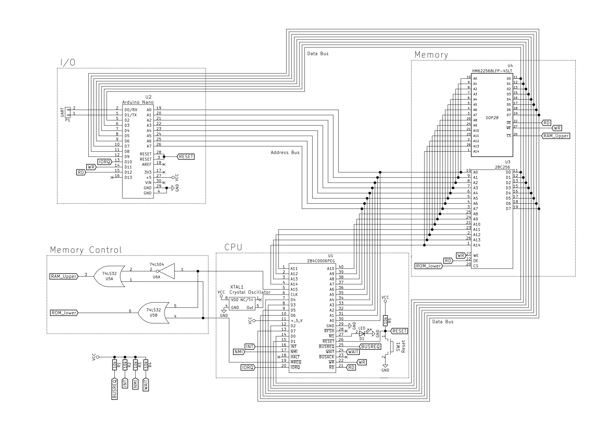

# 8-Bit Z80 Based Computer
<h3>2019 03 05</h3>

Last weekend I decided to design an SBC (**S**ingle **B**oard **C**omputer). I
chose the Z80 for this project as it a fairly simple processor to use. For the
memory I have used a HM62256 (32K) and a 28C256 for the ROM. Below is the
memory map for the computer: 
- 0x0000 ~ 0x8000 - 32K ROM 
- 0x8001 ~ 0xFFFF - 32K RAM  

Here is the schematic:
 

 
In the schematic you can see I have used an Arduino Nano for I/O. I have done
this as it is easier than designing dedicated I/O decoding logic.
 
My next post will be about my RISC-V processor.